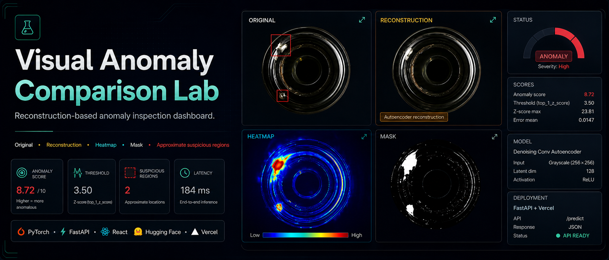
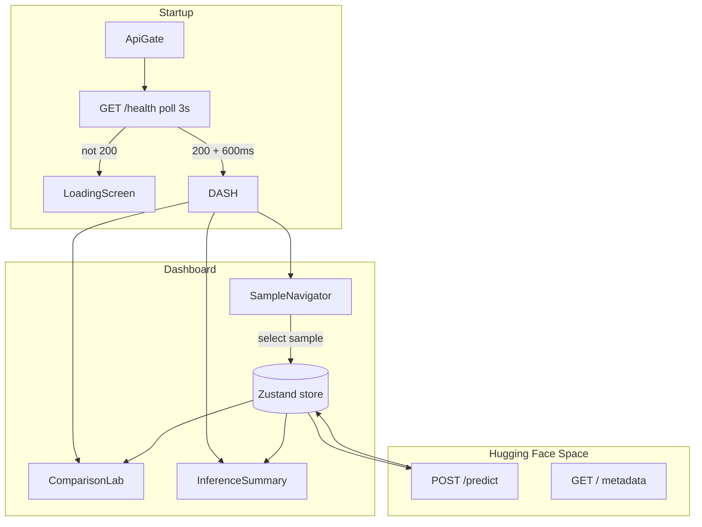

<p align="center">
  
</p>

<h1 align="center">Visual Anomaly Comparison Lab</h1>

<p align="center">
  Reconstruction-based anomaly inspection dashboard for bottle defect analysis using a denoising convolutional autoencoder, heatmaps, masks, anomaly scores, and approximate suspicious-region overlays.
</p>

<p align="center">
  <a href="https://visual-anomaly-comparison-lab.vercel.app/"><strong>Live Demo</strong></a>
  &nbsp;·&nbsp;
  <a href="https://github.com/sidnei-almeida/visual-anomaly-comparison-lab"><strong>GitHub</strong></a>
</p>

<p align="center">
  <strong>Next.js 15 · React 19 · TypeScript · Tailwind · Zustand · Recharts</strong><br />
  <em>Terra & cream inspection UI for MVTec AD bottle anomaly detection.</em>
</p>

<p align="center">
  
  
  
  
  
  
  
  
  
  
  
</p>

---

## What this is

A **full-screen visual comparison lab** for industrial anomaly inspection. Analysts select MVTec AD bottle samples (or upload their own) and compare four synchronized views: **original**, **reconstruction**, **heatmap**, and **mask** — with **client-drawn reticle bounding boxes** on the original panel.

Inference runs **entirely in the browser**. A **multi-product denoising convolutional autoencoder** (~1.38M parameters) is exported to ONNX and executed with onnxruntime-web (WebAssembly), and the whole post-processing chain — category z-score normalization, top-1% scoring, foreground masking and connected-component boxes — is a TypeScript port of the original Python service. There is no inference server and no serverless function: the deployment is static assets plus the existing sample route.

The dashboard does **not** train models. It orchestrates inference, caches session results, visualizes localization artifacts, and surfaces scores against category-specific thresholds shipped as JSON in the repository.

> **Live demo:** [visual-anomaly-comparison-lab.vercel.app](https://visual-anomaly-comparison-lab.vercel.app/)  
> **GitHub:** [github.com/sidnei-almeida/visual-anomaly-comparison-lab](https://github.com/sidnei-almeida/visual-anomaly-comparison-lab)  
> **V1 demo scope:** curated **bottle** catalog only (`category=bottle` on every inference).

### Interpretation note

Bounding boxes are **approximate visual hints** derived from reconstruction error maps — not supervised object-detection ground truth. The **heatmap** and **reconstruction** views are the primary interpretation outputs; use boxes as quick localization cues only.

---

## Application layout & workflow

Single-page lab (`/`) wrapped by a **model gate** that blocks the UI until the ONNX weights, the category error profile and the WebAssembly runtime have downloaded and the autoencoder has run one warm-up pass.

| Zone | Component | Purpose |
|------|-----------|---------|
| **Top bar** | `Topbar` | Brand, session clock, engine status badge, utility actions |
| **Left sidebar** | `SampleNavigator` | Category pill, 44 curated samples, upload batch, run count |
| **Center** | `ComparisonLab` | 2×2 image grid (ORIGINAL · RECONSTRUCTION · HEATMAP · MASK) |
| **Right sidebar** | `InferenceSummary` | Scores, status gauge, timeline, model/localization cards |
| **Bottom bar** | `SidebarBatchActions` | Pending batch · Reprocess all · Stop · Ready chip |



**Typical session**

1. Splash screen waits for API wake-up (retries every 3s, 5s request timeout).
2. Bootstrap loads catalog, metadata, and optional default inspection.
3. Click a sample → `POST /predict` with `include_images=true`.
4. Review four panels; primary/secondary **corner-bracket boxes** on ORIGINAL (highest z-score = terra reticle).
5. Inspect **Status gauge** (score ÷ threshold ratio), timeline entries, session aggregates.
6. Run **Pending** or **Reprocess all** from the bottom bar for batch workflows.

---

## Main features

### Four-panel comparison grid

| Panel | API field | Background | Notes |
|-------|-----------|------------|-------|
| **ORIGINAL** | `images.original` or catalog fallback | `#0d0906` | Client-side bbox overlays in model `image_size` space |
| **RECONSTRUCTION** | `images.reconstruction` | `#0d0906` | Autoencoder output — primary comparison target |
| **HEATMAP** | `images.heatmap` | `#000000` | Category-normalized error map; one-shot scanline on load |
| **MASK** | `images.mask` | `#000000` | Binary suspicious region; scanline delayed 100ms |

Panels use `object-fit: contain`, staggered **fade + slide-in** on new results, and a brief **opacity crossfade** when switching samples.

### Client-side bounding boxes (reticle style)

Boxes are **not** burned into API images (`include_overlay=false`). The browser:

- Converts API coordinates using `image_size` (256×256) and `object-fit: contain` layout math (`src/lib/bbox-layout.ts`).
- Draws **L-shaped corner brackets** (not full rectangles) with primary `#e07a5f` / secondary `#95573E` styling.
- Labels show compact `z {score}` tags above the top-left corner.
- Animates the **primary** reticle with a subtle lock-on pulse.

> Boxes are **approximate suspicious regions** from connected components on the z-map — not supervised object-detection ground truth.

### Inspection summary (right sidebar)

- **Scores** — category, anomaly score, threshold, z-map max, latency, error mean (animated count-up on change).
- **Status gauge** — semicircular dial for score/threshold ratio; severity band; OK / ANOMALY badge with flash on change.
- **Timeline** — latest 5 runs + “View full timeline” modal.
- **Model** — type label (Multi-product DAE).
- **Localization** — method, visible box count, disclaimer when boxes hidden.
- **Session aggregate** — processed count, anomaly rate, avg score, avg latency after batch runs.

### Sample navigator & batch line

- **44 curated bottle images** in `data/catalog/` (7 pass · 37 anomaly).
- Seven pass samples excluded from the navigator when prone to false positives (`scripts/excluded-pass-samples.ts`).
- **Upload batch** — PNG/JPEG via `react-dropzone`; manual category for uploads.
- **Pending** — inspect only samples without cached results (skips unsupported).
- **Reprocess all** — force re-inference on every catalog sample.
- **Stop** — abort in-flight batch with `AbortController`.

### Model gate (`ApiGate`)

The splash screen shows a progress bar driven by the actual asset download:

| Stage | User message |
|-------|----------------|
| `runtime` | Starting inference runtime… |
| `weights` | Downloading model weights… |
| `profile` | Loading category error profile… |
| `warmup` | Warming up the autoencoder… |
| `ready` | ✓ Model ready. Loading dashboard… |

First visit pulls roughly 19 MB uncompressed (13 MB WebAssembly runtime, 5.3 MB ONNX weights, 512 KB error profile), all served with immutable cache headers so repeat visits start instantly. A failed load shows the error and a **Retry** button.

### Polish & accessibility

- Terra/cream **design tokens** in `globals.css` (Syne + JetBrains Mono).
- Micro-interactions: button transitions, timeline hover, batch `:active` scale, panel load stagger.
- `prefers-reduced-motion` disables animations globally.
- Favicon + Apple touch icon + `site.webmanifest` for Vercel/PWA metadata.

### Optional demo fallback

When `NEXT_PUBLIC_ALLOW_DEMO_FALLBACK=true`, failed inferences can record **synthetic local results** (clearly labeled). Sessions mixing demo and live data prompt reset before new real runs.

---

## Design system

Built for long inspection sessions: warm dark base, terra accents, monospace metrics.

| Element | Implementation |
|---------|----------------|
| **Typography** | [Syne](https://fonts.google.com/specimen/Syne) (UI) + [JetBrains Mono](https://www.jetbrains.com/plex/mono/) (scores, labels, tables) via `next/font` |
| **Background** | `--bg-0` `#060503` through `--bg-3` `#241810` |
| **Accent** | `--terra` `#95573E`, `--anomaly` `#e07a5f`, `--cream` `#FBE4C5` |
| **Sidebars** | Left 168px · Right 200px · Top 36px · Bottom action 32px |
| **Panels** | Grid borders `0.5px`, headers on `--bg-2`, image stages per panel type |
| **Status** | OK green `#7aaa5e` · Anomaly terra · Pending warm gray |
| **Logo** | `LabLogoMark` SVG — dual-pane + eye + anomaly dot + reticle corners |

Tokens live in `src/app/globals.css`. Brand mark: `src/components/brand/LabLogoMark.tsx`.

---

## Model & scoring

| Property | Value |
|----------|--------|
| **Experiment** | `mvtec_structured_objects_dae_v1` |
| **Architecture** | Denoising ConvAutoencoder (~1.38M parameters) |
| **Input** | 256×256 RGB, `[0, 1]` after ToTensor |
| **Training loss** | L1 · Adam · noise factor 0.04 |
| **Recommended score** | `top_1_z_score` (top 1% of category-normalized error map) |
| **Threshold (bottle)** | **3.911** (validation p95, category-specific) |
| **Localization** | Connected components on z-map (max 2 boxes, conservative percentiles) |
| **Runtime** | ONNX opset 17, executed by onnxruntime-web on WebAssembly (single-threaded) |
| **Typical latency** | ~40–180 ms per image on a desktop browser |

Multi-product thresholds for capsule, hazelnut, metal_nut, pill, screw, and zipper remain in `src/data/model-artifacts/thresholds.json` for reference; the **V1 UI runs `bottle` only**, and only the bottle error profile is shipped to the browser.

### Parity with the original Python service

The TypeScript pipeline reproduces the reference implementation step for step, including the details that change results:

- **Resampling** — a port of Pillow's bicubic filter (`src/lib/cv/resize.ts`) rather than canvas scaling, which uses a different kernel.
- **OpenCV ports** — `GaussianBlur` with the hardcoded 5-tap kernel and `BORDER_REFLECT_101`, Otsu thresholding, 8-connectivity connected components in raster label order, rectangular morphology, and the exact `COLORMAP_JET` lookup table.
- **NumPy semantics** — linear-interpolation percentiles, float32 arithmetic where NumPy stays in float32, and `astype(uint8)` truncation.

`npm run test:parity` checks the port against reference outputs captured from the Python service. On the sample set, the resized input, localization mask and box geometry match exactly, and scores agree to ~1e-6 relative.

---

## Tech stack

| Layer | Choice |
|-------|--------|
| Framework | Next.js 15 (App Router, Turbopack dev) |
| Language | TypeScript 5.8 |
| Styling | Tailwind CSS 3 + CSS variables (`@layer components`) |
| State | Zustand 5 |
| Charts | Recharts 2 (session charts modal) |
| Icons | Lucide React |
| Dates | date-fns 4 |
| Inference | onnxruntime-web 1.29 (WebAssembly backend) |
| Images | sharp (build) · local catalog via `/api/samples/[filename]` |
| Validation scripts | tsx |

---

## Environment

No environment variables are required — the model ships with the app. Two optional flags remain:

```env
# Optional: synthetic results when inference fails
# NEXT_PUBLIC_ALLOW_DEMO_FALLBACK=false

# Optional: bbox coordinate debug logs in browser console
# NEXT_PUBLIC_DEBUG_BBOX=true
```

| Variable | Description |
|----------|-------------|
| `NEXT_PUBLIC_ALLOW_DEMO_FALLBACK` | Enable labeled demo fallback results |
| `NEXT_PUBLIC_DEBUG_BBOX` | Verbose bbox layout logging |

Supported categories in artifacts: `bottle`, `capsule`, `hazelnut`, `metal_nut`, `pill`, `screw`, `zipper` — **UI V1 locks to `bottle`** (`src/config/api-categories.ts`).

---

## Quick start

```bash
git clone https://github.com/sidnei-almeida/visual-anomaly-comparison-lab.git
cd visual-anomaly-comparison-lab

npm install
npm run dev
```

Open [http://localhost:3000](http://localhost:3000).

`predev` and `prebuild` copy the onnxruntime-web WebAssembly files from `node_modules` into `public/ort/`, so that directory is generated and git-ignored. The ONNX weights and the error profile in `public/model/` are committed.

### Re-exporting the model

Only needed after retraining. Requires a Python environment with `torch`, `numpy` and `onnx`, plus a checkout of the [`anomaly_detection_unet`](https://github.com/sidnei-almeida/anomaly_detection_unet) repo next to this one:

```bash
pip install -r scripts/requirements.txt
npm run model:export      # writes public/model/{dae-bottle.onnx,bottle-profile.bin,model-assets.json}
```

### Production build

```bash
npm run build
npm start
```

### Validation scripts

```bash
npm run test:selection    # sample selection flow
npm run test:categories   # category resolution rules
npm run test:bbox         # bbox coordinate math
npm run catalog:rebuild   # regenerate data/catalog/manifest.json

# Parity against the original Python pipeline (needs the fixture below)
python scripts/make-parity-fixture.py /tmp/parity-fixture
FIXTURE_DIR=/tmp/parity-fixture npm run test:parity
```

---

## Deploy on Vercel

1. Import [visual-anomaly-comparison-lab](https://github.com/sidnei-almeida/visual-anomaly-comparison-lab) on [Vercel](https://vercel.com).
2. Framework preset: **Next.js**
3. No environment variables required.
4. Deploy — live app: [visual-anomaly-comparison-lab.vercel.app](https://visual-anomaly-comparison-lab.vercel.app/)

Inference happens client-side, so nothing runs in a serverless function beyond the catalog image route. The build stays well inside the Hobby plan's function size limits — a PyTorch-based API would not, which is why the model was ported to ONNX rather than lifted into a Python function.

Static assets (`public/icon.svg`, `site.webmanifest`) and App Router metadata (`src/app/icon.svg`, `apple-icon.svg`) provide favicons and theme color `#0A0A0A` (ThinkPad X1 Carbon).

---

## Repository structure

```
visual-anomaly-comparison-lab/
├── header/
│   └── header.png               # README banner
├── public/
│   ├── icon.svg                 # Favicon + README hero
│   ├── apple-icon.svg           # Apple touch icon
│   ├── site.webmanifest         # PWA manifest
│   ├── model/                   # dae-bottle.onnx, bottle-profile.bin, model-assets.json
│   └── ort/                     # onnxruntime-web wasm (generated, git-ignored)
├── src/
│   ├── app/
│   │   ├── layout.tsx           # Fonts, metadata, viewport theme
│   │   ├── page.tsx             # ApiGate → AppShell
│   │   ├── icon.svg             # Next.js auto favicon
│   │   ├── apple-icon.svg
│   │   ├── globals.css          # Design tokens + animations
│   │   └── api/samples/[filename]/  # Serve catalog images
│   ├── components/
│   │   ├── brand/               # LabLogoMark
│   │   ├── gate/                # ApiGate, LoadingScreen
│   │   ├── inspection/          # Provider, navigator, sample rows
│   │   ├── viewer/              # ComparisonLab, InspectionImagePanel
│   │   ├── results/             # Summary, gauge, technical details
│   │   ├── timeline/            # Sidebar timeline + batch actions
│   │   ├── dashboard/           # Session charts modal
│   │   └── layout/              # Topbar, AppShell export
│   ├── config/
│   │   ├── api-categories.ts    # Bottle-only V1 rules
│   │   ├── health-check.ts      # Splash gate timing
│   │   └── mvtec-dae-artifacts.ts
│   ├── data/
│   │   ├── model-artifacts/     # thresholds, bbox, config, manifest JSON
│   │   └── inspection-catalog.ts
│   ├── hooks/                   # useCountUp
│   ├── lib/
│   │   ├── cv/                  # Pillow resize, OpenCV filter/segmentation/colormap ports
│   │   ├── inference/           # ONNX session, image I/O, scoring pipeline
│   │   └── anomaly-api.ts       # Engine facade (predict payload shape), bbox-layout, predict-mapper
│   ├── services/                # inspectionService, api facade
│   └── store/                   # inspection-store (Zustand)
├── data/catalog/                # inspect-bottle-*.png + manifest.json
├── scripts/                     # model export, parity tests, catalog generators
├── readme_model.md              # README style reference
├── .env.example
└── next.config.ts
```

---

## Inference surface

`src/lib/anomaly-api.ts` is the single entry point. It keeps the response shape of the retired `POST /predict` endpoint, so the store, mappers and components were untouched by the migration.

| Export | Purpose |
|--------|---------|
| `preloadModel(onProgress)` | Download weights + profile, create the session, run a warm-up pass |
| `getApiHealth()` | Engine readiness in the old `/health` shape |
| `predictAnomaly(blob, options)` | Decode, resize, run the autoencoder, post-process, return the payload |
| `inspectSample` / `inspectUpload` | Convenience wrappers for catalog samples and uploads |

**Pipeline**

```
Blob → createImageBitmap → native RGB
     → Pillow-compatible bicubic resize to 256×256
     → CHW float tensor in [0, 1]
     → ONNX autoencoder (onnxruntime-web, wasm)
     → |input − reconstruction| → category z-map → 5×5 Gaussian blur
     → top-1% mean vs threshold           (classification)
     → Otsu foreground mask → p96 mask → connected components  (localization)
     → PNG data URLs for the four panels
```

**Payload highlights**

```json
{
  "status": "anomaly",
  "is_anomaly": true,
  "category": "bottle",
  "scores": {
    "anomaly_score": 9.775,
    "threshold": 3.911,
    "error_mean": 0.01195,
    "z_map_max": 32.932
  },
  "image_size": { "width": 256, "height": 256 },
  "boxes": [{ "x": 120, "y": 80, "w": 40, "h": 35, "max_z": 32.9 }],
  "images": {
    "original": "data:image/png;base64,...",
    "reconstruction": "...",
    "heatmap": "...",
    "mask": "..."
  }
}
```

### Client-side coordinate scaling

```
scaleX = renderedWidth  / image_size.width
scaleY = renderedHeight / image_size.height
left   = box.x * scaleX
top    = box.y * scaleY
```

Implemented in `modelBoxToRenderedRect()` with `object-fit: contain` letterboxing.

---

## Curated sample catalog

| Defect type | Navigator count |
|-------------|-----------------|
| Pass (good) | 7 |
| Large break | 12 |
| Small break | 13 |
| Contamination | 12 |
| **Total** | **44** |

Files live under `data/catalog/inspect-bottle-*.png`. Metadata is regenerated with:

```bash
npm run catalog:rebuild
```

---

## Model artifacts in-repo

JSON exports from training run `mvtec_structured_objects_dae_v1`:

| File | Contents |
|------|----------|
| `config.json` | Architecture, dataset splits, preprocessing |
| `thresholds.json` | Per-category p95 z-score thresholds |
| `bbox-visualization.json` | Box method, score map formula, UI guidance |
| `manifest.json` | Recommended inference pipeline steps |

Loaded by `src/config/mvtec-dae-artifacts.ts` for sidebar reference, bbox UI constants and the runtime threshold.

Binary artifacts consumed by the browser engine live in `public/model/`:

| File | Contents |
|------|----------|
| `dae-bottle.onnx` | Autoencoder weights, opset 17, float32 (~5.3 MB) |
| `bottle-profile.bin` | Packed float32 mean then std error maps, 256×256 each (512 KB) |
| `model-assets.json` | Sizes, SHA-256 checksums and tensor layout from the export |

Regenerate all three with `npm run model:export`.

---

## Disclaimer

Reconstruction error, heatmaps, masks, and approximate bounding boxes are for **visual inspection demos and research comparison only**. They are not certified for production quality control, regulatory compliance, or safety-critical manufacturing decisions. Always validate against domain experts and ground-truth protocols.

Demo fallback results (when enabled) are synthetic and must not be treated as live model output.

---

## License & author

**Sidnei Alves de Almeida** — [@sidnei-almeida](https://github.com/sidnei-almeida)

**Repository:** [github.com/sidnei-almeida/visual-anomaly-comparison-lab](https://github.com/sidnei-almeida/visual-anomaly-comparison-lab)

---

<p align="center">
  <sub>Style reference: <code>readme_model.md</code> · MVTec AD bottle inspection · DAE V1</sub>
</p>
